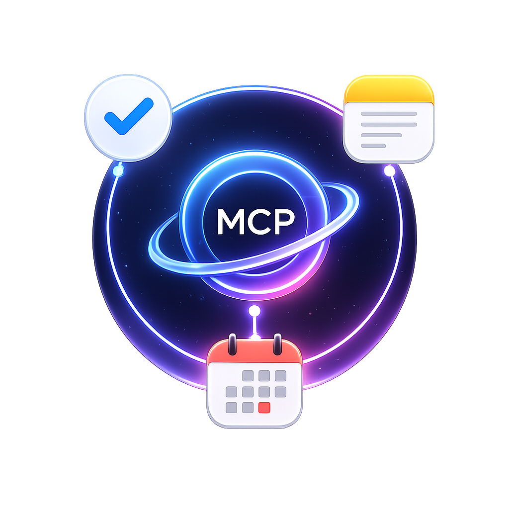
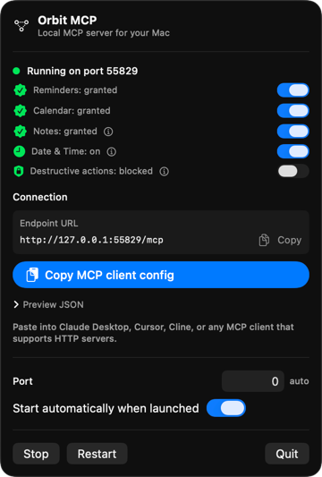
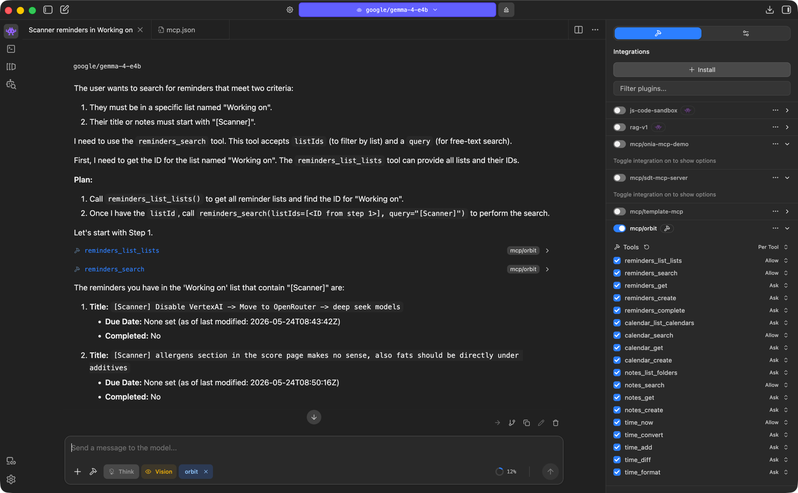

# Orbit MCP



Orbit MCP is a macOS menu bar app that exposes local Apple services to MCP-compatible clients over a local Streamable HTTP server.




Current tools cover:

- Apple Reminders: list, search, create, update, complete, and delete reminders.
- Apple Calendar: list calendars, search events, create, update, and delete events.
- Apple Notes: list folders, search notes, read notes, create, update, and delete notes.
- Time utilities: current time, timezone conversion, date math, differences, and formatting.

The server binds to `127.0.0.1` and is intended for local MCP clients such as Claude Desktop, Cursor, Cline, or other tools that support HTTP MCP servers.

## Requirements

- macOS
- Xcode
- Calendar and Reminders permissions for EventKit tools
- Apple Events automation permission for Notes tools

## Build

Open `Orbit MCP.xcodeproj` in Xcode and run the `Orbit MCP` scheme, or build from the command line:

```sh
xcodebuild build -project "Orbit MCP.xcodeproj" -scheme "Orbit MCP" -destination "platform=macOS"
```

The checked-in Xcode project uses `AAAAAAAA` as a placeholder Apple Development Team ID. Before distributing signed builds, replace it with your own team ID in Xcode's Signing & Capabilities settings or pass signing settings through your build environment.

## Usage

Launch Orbit MCP from Xcode or from the built app. The app appears in the menu bar and shows the local MCP endpoint.

Copy the generated client configuration from the menu bar UI into your MCP client. With the default bearer-token protection on, it will look like:

```json
{
  "mcpServers": {
    "orbit": {
      "url": "http://127.0.0.1:<port>/mcp",
      "headers": {
        "Authorization": "Bearer <generated-token>"
      }
    }
  }
}
```

The token is generated on first launch and stored locally. Use the menu bar to rotate it; you can also turn the requirement off if your MCP client cannot send custom headers, but doing so lets any other local process on the Mac reach the same tools.

The app remembers the last bound port so existing MCP client configs can keep working between launches when possible.

You can use it in any tools that supports MCPs, like Codex, Cursor, LMStudio etc.

## Privacy And Permissions

Orbit MCP operates on local personal data on the Mac where it is running. It does not require a hosted backend.

The app can read and modify Reminders, Calendar events, and Notes after macOS permissions are granted. Only enable the services you want exposed to your MCP client.

## Security Notes

Orbit MCP is designed for local use only. Do not expose its local HTTP endpoint to a network interface, proxy, tunnel, or shared machine unless you understand the risk of giving another process access to your personal data.

By default the server requires `Authorization: Bearer <token>` on every `/mcp` request. The token is generated on first launch, embedded in the copied client config, and can be rotated from the menu bar. The server also rejects browser cross-origin requests outside the loopback origin and caps request size to prevent local DoS.

See [SECURITY.md](SECURITY.md) for vulnerability reporting and security expectations.

## Development

Run tests with:

```sh
xcodebuild test -project "Orbit MCP.xcodeproj" -scheme "Orbit MCP" -destination "platform=macOS"
```

The UI test targets are currently lightweight launch tests.
